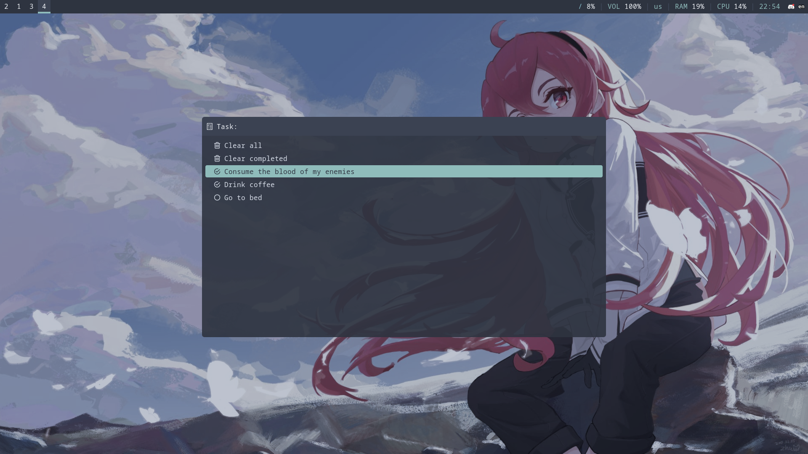

# rofi-checklist

A minimalist checklist menu for [rofi](/davatorium/rofi).

## Installation

The icons in rofi-checklist require the usage of [Nerd Fonts](https://www.nerdfonts.com/).

### Arch Linux

rofi-checklist is available on the AUR under [rofi-checklist-git](https://aur.archlinux.org/packages/rofi-checklist-git). If you have the AUR helper [yay](/Jguer/yay) installed, you can easily install rofi-checklist on your system using the following command:

```SH
yay -S rofi-checklist-git
```

If you didn't have rofi installed, it will now be on your system as a dependency of rofi-checklist.

This is my first package on the AUR, so my apologies if I've made any mistakes packaging it!

### Other Linux distros

After installing rofi, copy [rofi-checklist.sh](rofi-checklist.sh) to `/usr/bin/rofi-checklist`.

## Usage

rofi-checklist is best used when mapped to a keybinding. For example, in i3, you can map it `Alt`+`T` (**T** for **T**asks) by adding `bindsym Mod1+T exec rofi-checklist` to your `~/.config/i3/config` file.

In terms of usage, rofi-checklist is very simple to use. When launched, it shows a list of currently available tasks. If you select an incomplete task, it gets marked as completed, and selecting it again removes it from the list. There are two actions at the top of the list, one for clearing all tasks and one for clearing only completed tasks. If you want to add a new task, simply type in a task name that doesn't exist yet and press enter.

rofi-checklist stores the checklist in `~/.rofi-checklist` in a markdown-compliant format, such as the following:

```MD
- [x] Consume the blood of my enemies
- [x] Drink coffee
- [ ] Go to bed
```

This is useful because it allows the checklist to be used within markdown editors. For example, if you make a symbolic link from `~/.rofi-checklist` to somewhere in your [Obsidian](https://obsidian.md/) vault, then this creates a nice integration into your knowledge management software. If there's interest, support for more checklist file sources might be added in the future.
